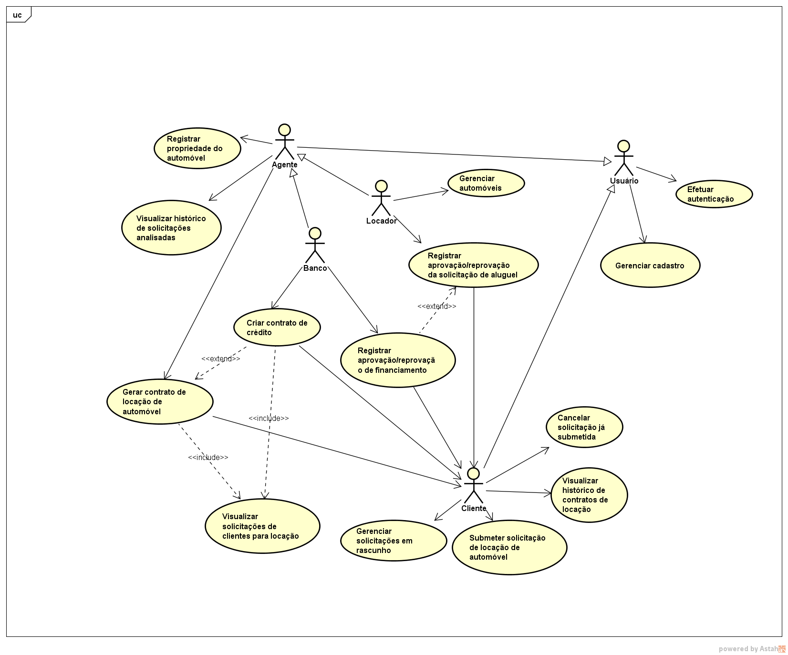
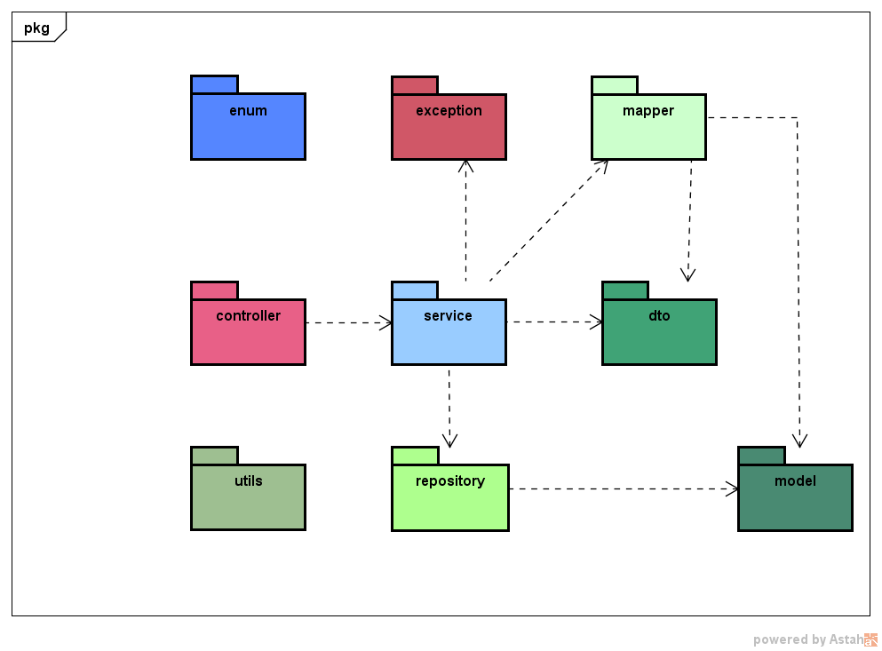
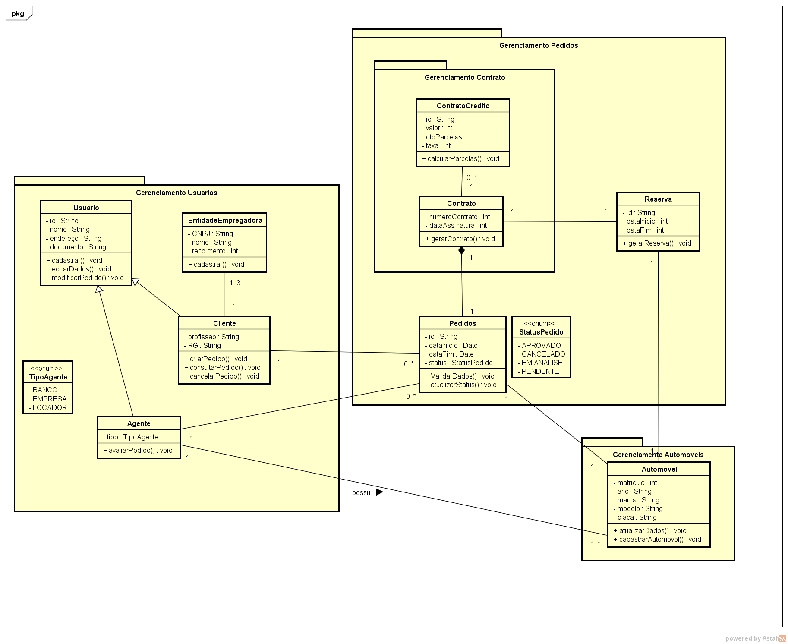
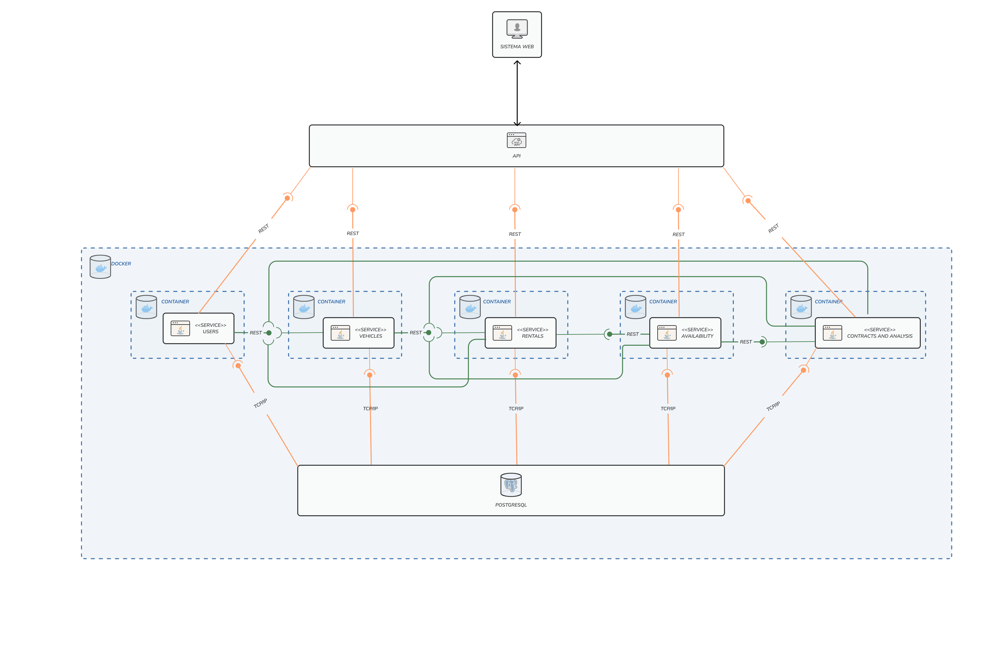
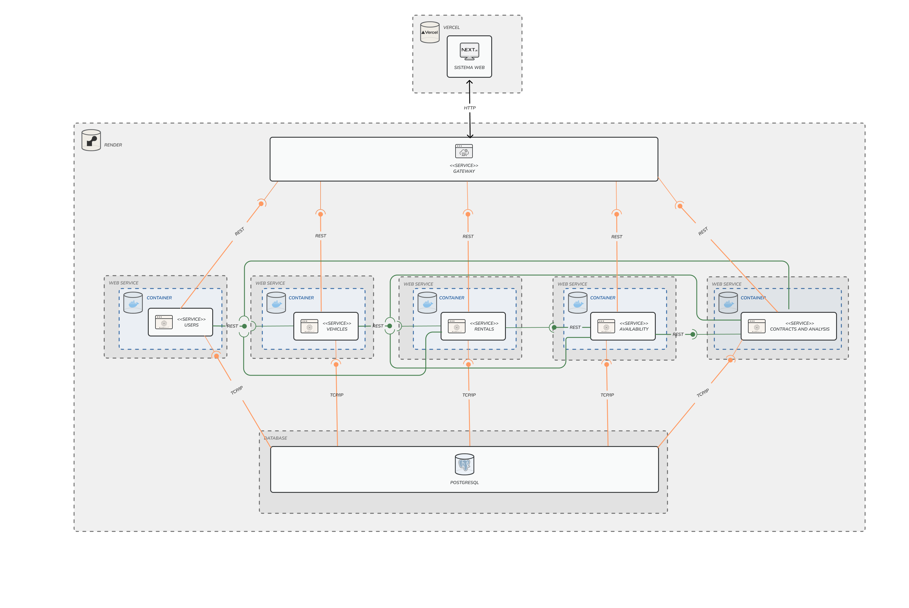

# Sistema de Aluguel de Carros

> **Disciplina:** Laboratório de Desenvolvimento de Software  
> **Curso:** Engenharia de Software  
> **Professor:** João Paulo Carneiro Aramuni

<div align="center">

Projeto acadêmico desenvolvido para a disciplina de Laboratório de Desenvolvimento de Software, com frontend em Next.js e backend orientado a microserviços em Micronaut.

<p>
  
  
  
  
  
  
  
</p>

</div>

---

## Sumário

- [Contexto Acadêmico](#contexto-acadêmico)
- [Visão Geral](#visão-geral)
- [Arquitetura](#arquitetura)
- [Microserviços](#microserviços)
- [Hospedagem](#hospedagem)
- [Tecnologias Utilizadas](#tecnologias-utilizadas)
- [Estrutura do Repositório](#estrutura-do-repositório)
- [Arquitetura de Pastas Detalhada](#arquitetura-de-pastas-detalhada)
- [Como Rodar o Projeto](#como-rodar-o-projeto)
- [Fluxos de Desenvolvimento](#fluxos-de-desenvolvimento)
- [Documentação do Projeto](#documentação-do-projeto)
- [Design System do Frontend](#design-system-do-frontend)
- [Equipe](#equipe)

## Contexto Acadêmico

Este projeto corresponde ao **LAB02** da disciplina de Laboratório de Desenvolvimento de Software e foi desenvolvido com foco em arquitetura de software moderna, separação de responsabilidades e documentação completa de engenharia.

## Visão Geral

O Sistema de Aluguel de Carros foi modelado para atender ao fluxo completo de locação de automóveis, desde o cadastro de clientes e agentes até a análise de pedidos, reserva de veículos e geração de contratos.

O repositório foi organizado como um monorepo com duas frentes principais:

- `Codigo/client`: frontend web em Next.js.
- `Codigo/Server`: gateway, microserviços backend, scripts operacionais e infraestrutura local.

O backend segue uma arquitetura de microserviços com responsabilidades bem separadas, comunicação HTTP via gateway e persistência relacional em PostgreSQL.

## Arquitetura

### Visão macro

1. O frontend envia requisições para um único ponto de entrada.
2. O API Gateway recebe essas requisições e encaminha para o microserviço correto.
3. Cada microserviço possui domínio, regras de negócio e migrações de banco próprias.
4. O PostgreSQL concentra a persistência relacional do ambiente local.

### Componentes principais

| Camada | Responsabilidade | Stack principal |
| --- | --- | --- |
| Frontend | Interface web do sistema | Next.js, React, TypeScript, Tailwind CSS |
| Gateway | Entrada única e roteamento | Micronaut, Netty, Proxy HTTP Client |
| Users Service | Usuários, clientes, agentes e autenticação | Micronaut Data, JWT, Flyway |
| Vehicles Service | Cadastro e consulta de automóveis | Micronaut Data, Flyway |
| Rentals Service | Pedidos de aluguel e análise de fluxo | Micronaut Data, HTTP Client, Flyway |
| Reservas Service | Disponibilidade e bloqueio de reservas | Micronaut Data, Flyway |
| Contrato Service | Contratos de locação e crédito | Micronaut Data, Flyway |
| Banco de dados | Persistência relacional | PostgreSQL |

### Fluxo de chamadas no ambiente local

```text
Next.js (3000)
   |
   v
Gateway (8000)
   |-- /usersService/**    -> usersService (8080)
   |-- /vehiclesService/** -> vehiclesService (8081)
   |-- /rentalsService/**  -> rentalsService (8082)
   |-- /contratoService/** -> contratoService (8083)
   \-- /reservasService/** -> reservasService (8084)

PostgreSQL (5433 no host / 5432 no container)
PGWeb (8090)
```

### Ponto importante sobre o gateway

O gateway aplica strip prefix. Isso significa que uma rota como `/usersService/alguma-rota` é recebida pelo gateway, o prefixo `/usersService` é removido e a requisição é encaminhada para o controller raiz correspondente no microserviço.

## Microserviços

### API Gateway

- Pasta: `Codigo/Server/gateway`
- Porta local: `8000`
- Função: roteamento, CORS, proxy e centralização das chamadas do frontend.

### Users Service

- Pasta: `Codigo/Server/usersService`
- Porta local: `8080`
- Prefixo via gateway: `/usersService`
- Responsabilidades:
  - cadastro de clientes
  - cadastro de agentes
  - autenticação de usuários
  - gestão de endereço, documentos e dados básicos

### Vehicles Service

- Pasta: `Codigo/Server/vehiclesService`
- Porta local: `8081`
- Prefixo via gateway: `/vehiclesService`
- Responsabilidades:
  - cadastro de automóveis
  - consulta de veículos disponíveis
  - atualização de proprietário e dados do veículo

### Rentals Service

- Pasta: `Codigo/Server/rentalsService`
- Porta local: `8082`
- Prefixo via gateway: `/rentalsService`
- Responsabilidades:
  - criação de pedidos de aluguel
  - manutenção de pedidos em rascunho
  - validação de cliente e automóvel
  - fluxo de envio para análise

### Contrato Service

- Pasta: `Codigo/Server/contratoService`
- Porta local: `8083`
- Prefixo via gateway: `/contratoService`
- Responsabilidades:
  - criação e consulta de contratos
  - suporte ao fluxo de contrato de crédito e locação

### Reservas Service

- Pasta: `Codigo/Server/reservasService`
- Porta local: `8084`
- Prefixo via gateway: `/reservasService`
- Responsabilidades:
  - verificação de disponibilidade
  - bloqueio de períodos
  - controle de reservas associadas aos veículos

## Hospedagem

### Backend em produção

Os cinco microserviços de domínio do projeto estão hospedados no Render, e não mais no Fly.io.

| Serviço | Hospedagem atual |
| --- | --- |
| usersService | Render |
| vehiclesService | Render |
| rentalsService | Render |
| contratoService | Render |
| reservasService | Render |

O README foi atualizado considerando esse cenário de deploy. Caso você exponha o gateway ou o frontend em produção, as URLs públicas devem ser configuradas pelas variáveis de ambiente do ambiente alvo.

### Ambiente local

Para desenvolvimento local, o projeto continua preparado para execução completa com Docker Compose a partir de `Codigo/Server`, incluindo gateway, microserviços, PostgreSQL e PGWeb.

## Tecnologias Utilizadas

### Frontend

- Next.js `16.2.1`
- React `19.2.4`
- TypeScript `5`
- Tailwind CSS `4`
- Radix UI
- shadcn
- React Hook Form
- Zod
- Axios
- Zustand
- Sonner
- Lucide React
- next-themes

### Backend

- Java `21`
- Micronaut `4.10.10`
- Netty
- Micronaut HTTP Client
- Micronaut Data JDBC
- Micronaut Security JWT
- Micronaut Validation
- Flyway
- PostgreSQL Driver
- MapStruct
- BCrypt (`jbcrypt`)
- Cloudinary HTTP SDK
- JUnit 5

### Infraestrutura e Dev Experience

- Docker
- Docker Compose
- PostgreSQL `15`
- PGWeb
- Maven Wrapper
- ESLint
- Prettier
- Husky
- lint-staged

## Estrutura do Repositório

```text
Lab-Desenvolvimento-02-Sistema-de-Aluguel-de-Carros/
├── Codigo/
│   ├── client/              # Frontend em Next.js
│   └── Server/              # Gateway, microserviços, scripts e docker-compose
├── Docs/
│   ├── Diagramas/           # Diagramas exportados e arquivos Astah
│   └── historias-de-usuarios/
└── README.md                # Documentação principal do projeto
```

### Backend

```text
Codigo/Server/
├── gateway/
├── usersService/
├── vehiclesService/
├── rentalsService/
├── reservasService/
├── contratoService/
├── scripts/
├── env-pattern/
├── AI_CONTEXT.md
├── MICROSERVICE_TEMPLATE.md
├── README.md
└── docker-compose.yml
```

### Frontend

```text
Codigo/client/
├── public/
├── src/
│   ├── app/
│   ├── components/
│   ├── hooks/
│   ├── services/
│   ├── types/
│   └── ...
├── design-system.md
├── package.json
└── README.md
```

## Arquitetura de Pastas Detalhada

### 1. Documentação e artefatos de engenharia (`Docs`)

```text
Docs/
├── Diagramas/
│   ├── astah/
│   │   ├── diagrama-caso-de-uso-lab2.asta
│   │   ├── diagrama-de-classe.asta
│   │   └── diagrama-de-pacotes.asta
│   ├── Diagrama-caso-uso-lab2.png
│   ├── diagrama-de-classe.png
│   ├── diagrama-de-pacotes.png
│   ├── diagrama-de-componentes.png
│   └── diagrama-de-implantacao.png
└── historias-de-usuarios/
  └── Histórias de Usuário - Sistema de aluguel de carros - LAB2.pdf
```

### 2. Frontend (`Codigo/client`)

```text
Codigo/client/
├── public/                   # assets estáticos e logos
├── src/
│   ├── app/                  # rotas e páginas Next.js (App Router)
│   ├── components/           # componentes reutilizáveis de UI
│   ├── config/               # configurações centralizadas
│   ├── hooks/                # hooks customizados
│   ├── services/             # integração HTTP com o backend
│   ├── types/                # tipagens TypeScript
│   └── ...
├── design-system.md          # diretrizes visuais oficiais do projeto
├── package.json
└── README.md
```

### 3. Backend e infraestrutura (`Codigo/Server`)

```text
Codigo/Server/
├── gateway/                  # API Gateway (porta 8000)
├── usersService/             # domínio de usuários, clientes e agentes
├── vehiclesService/          # domínio de automóveis
├── rentalsService/           # domínio de pedidos de aluguel
├── reservasService/          # domínio de reservas e disponibilidade
├── contratoService/          # domínio de contratos
├── scripts/                  # automação local (up, down, rebuild, check)
├── env-pattern/              # modelos de variáveis de ambiente
├── AI_CONTEXT.md             # contexto técnico do backend para assistentes
├── MICROSERVICE_TEMPLATE.md  # guia para criar novo microserviço no padrão
├── README.md                 # guia operacional específico do backend
└── docker-compose.yml        # orquestração local completa
```

## Como Rodar o Projeto

### Pre-requisitos

- Java 21 instalado
- Node.js instalado
- Docker Desktop em execução
- npm disponivel no terminal

### 1. Clonar o repositório

```powershell
git clone <url-do-repositorio>
cd Lab-Desenvolvimento-02-Sistema-de-Aluguel-de-Carros
```

### 2. Configurar os arquivos `.env` do backend

Cada serviço backend possui um `.env.example`. Crie os arquivos `.env` necessários dentro das pastas dos serviços e ajuste as variáveis conforme o seu ambiente.

Pastas principais:

- `Codigo/Server/usersService/.env`
- `Codigo/Server/vehiclesService/.env`
- `Codigo/Server/rentalsService/.env`
- `Codigo/Server/reservasService/.env`
- `Codigo/Server/contratoService/.env`

Os arquivos de apoio em `Codigo/Server/env-pattern` servem como referência adicional para padronização.

### 3. Subir backend completo com Docker

Na raiz do backend:

```powershell
cd Codigo/Server
.\scripts\dev.cmd rebuild
```

Comandos mais importantes:

```powershell
.\scripts\dev.cmd up
.\scripts\dev.cmd check
.\scripts\dev.cmd logs
.\scripts\dev.cmd rebuild
.\scripts\dev.cmd down
```

### 4. Rodar o frontend

Em outro terminal:

```powershell
cd Codigo/client
npm install
npm run dev
```

O frontend será iniciado em:

- `http://localhost:3000`

### 5. Endpoints locais principais

| Recurso | URL |
| --- | --- |
| Frontend | `http://localhost:3000` |
| Gateway | `http://localhost:8000` |
| Diagnóstico do gateway | `http://localhost:8000/gateway/config` |
| PostgreSQL no host | `localhost:5433` |
| PGWeb | `http://localhost:8090` |

## Fluxos de Desenvolvimento

### Fluxo recomendado para frontend

Quando estiver trabalhando no frontend:

1. suba o backend completo com `Codigo/Server/scripts/dev.cmd up` ou `rebuild`
2. rode o client com `npm run dev`
3. mantenha o frontend apontando para o gateway na porta `8000`

Esse fluxo evita problemas de CORS e mantém a integração centralizada.

### Fluxo recomendado para backend

Quando estiver trabalhando em um microserviço específico:

1. derrube a orquestração com `Codigo/Server/scripts/dev.cmd down`
2. navegue até a pasta do serviço desejado
3. rode o script local do backend

Exemplo conceitual:

```powershell
cd Codigo/Server/usersService
..\scripts\run-local.ps1
```

Nesse modo, o serviço sobe nativamente na própria porta local, e você consegue iterar mais rápido no código Java. Esse fluxo é especialmente útil para depuração e desenvolvimento isolado de regras de negócio.

## Documentação do Projeto

O repositório possui documentação funcional, arquitetural e visual distribuída entre a raiz, a pasta `Docs` e os guias internos do backend e frontend.

### Documentos principais

| Documento | Finalidade |
| --- | --- |
| `Codigo/client/design-system.md` | Diretrizes visuais, tipografia, cores, componentes e identidade do frontend |
| `Codigo/Server/AI_CONTEXT.md` | Contexto de arquitetura do backend, gateway, portas e fluxo operacional |
| `Codigo/Server/MICROSERVICE_TEMPLATE.md` | Guia de criação e integração de novos microserviços |
| `Codigo/Server/README.md` | Guia operacional focado no backend |

### Diagramas

#### Diagrama de Caso de Uso

[](Docs/Diagramas/Diagrama-caso-uso-lab2.png)

Representa os atores principais do sistema e os fluxos de negócio associados, como autenticação, gerenciamento de cadastro, solicitação de aluguel, análise por agentes, contratos e históricos.

#### Diagrama de Pacotes

[](Docs/Diagramas/diagrama-de-pacotes.png)

Mostra a organização estrutural do backend em camadas como controller, service, repository, model, dto, mapper e exception, refletindo a separação adotada nos microserviços.

#### Diagrama de Classes

[](Docs/Diagramas/diagrama-de-classe.png)

Apresenta as entidades centrais do domínio, seus atributos e relacionamentos, incluindo usuários, clientes, agentes, pedidos, contratos, reservas e automóveis.

#### Diagrama de Componentes e Implantação

[](Docs/Diagramas/diagrama-de-componentes.png)

[](Docs/Diagramas/diagrama-de-implantacao.png)

Esses diagramas mostram como frontend, gateway, microserviços e banco de dados se conectam, tanto na visão lógica quanto na visão de implantação.

### Arquivos-fonte dos diagramas

Os arquivos editáveis do Astah estão em:

- `Docs/Diagramas/astah/diagrama-caso-de-uso-lab2.asta`
- `Docs/Diagramas/astah/diagrama-de-classe.asta`
- `Docs/Diagramas/astah/diagrama-de-pacotes.asta`

### Histórias de usuário

O conjunto de histórias de usuário do projeto está documentado em:

- [Histórias de Usuário - Sistema de aluguel de carros - LAB2.pdf](Docs/historias-de-usuarios/Hist%C3%B3rias%20de%20Usu%C3%A1rio%20-%20Sistema%20de%20aluguel%20de%20carros%20-%20LAB2.pdf)

Essas histórias cobrem, entre outros pontos:

- cadastro de cliente
- cadastro e gestão de agentes
- cadastro de automóveis
- autenticação
- solicitação, envio, consulta e cancelamento de pedidos
- aprovação e reprovação por locador e banco
- criação de contratos
- notificações e históricos

## Design System do Frontend

O frontend possui uma documentação de design dedicada em `Codigo/client/design-system.md`, com uma direção visual editorial e inspirada em experiência premium automotiva.

Pontos centrais desse design system:

- direção criativa baseada em experiência editorial premium
- paleta com azul institucional e neutros frios
- tipografia com DM Serif Display e DM Sans
- uso de componentes com profundidade tonal em vez de excesso de bordas
- definição de tokens semânticos de cor, espaçamento e radius
- mapeamento visual de status do fluxo de locação

Também estão documentadas as regras de uso da identidade visual e dos logos do projeto na pasta `Codigo/client/public/images/logos`.

## Equipe

| Nome | Foto | GitHub | LinkedIn |
| --- | --- | --- | --- |
| Eric Leal | <div align="center"></div> | <div align="center"><a href="https://github.com/Eric-Leal">@Eric-Leal</a></div> | <div align="center"><a href="https://linkedin.com/in/ericgleal">Perfil</a></div> |
| Laura Pontara | <div align="center"></div> | <div align="center"><a href="https://github.com/LauraPontara">@LauraPontara</a></div> | <div align="center"><a href="https://linkedin.com/in/laura-pontara">Perfil</a></div> |
| Giuliano Percope | <div align="center"></div> | <div align="center"><a href="https://github.com/GiulianoLBP">@GiulianoLBP</a></div> | <div align="center"><a href="https://www.linkedin.com/in/giuliano-lb-percope/">Perfil</a></div> |

---

Desenvolvido para fins academicos no contexto do Laboratorio de Desenvolvimento de Software.
